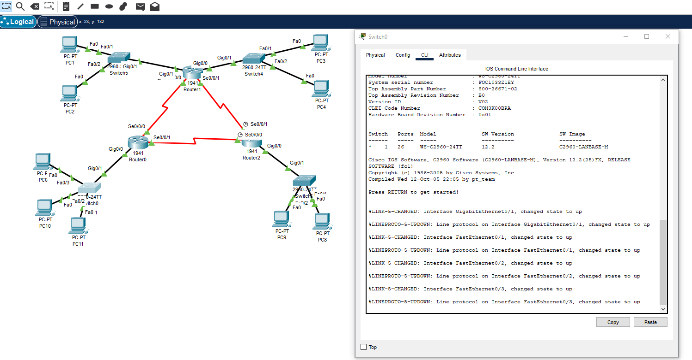

<br />
<div align="center">
	<h3 align="center">Cisco Packet Tracer (Networks)</h3>
	<p align="center">
    	Scripts used in an industrial networks class using Cisco training software.
  	</p>
</div>

## Installation

1. Join Cisco's training course [Skills for All](https://skillsforall.com/).
1. Download and install [Cisco Packet Tracer](https://www.netacad.com/courses/packet-tracer)
3. Clone the Repo
   ```sh
   git clone https://github.com/DarioArzaba/CiscoPacketNetwork.git
   cd CiscoPacketNetwork
   ```
4. Open, modify and run `pkt` or `pka` (activity) files.

</br>
<div align="center"> <p> Example of IP switching and routing activity (1000) hosts </p> </div>

## License

Distributed under the [MIT License](https://mit-license.org/).

## Contact

Dario Arzaba - dario.arzaba@gmail.com